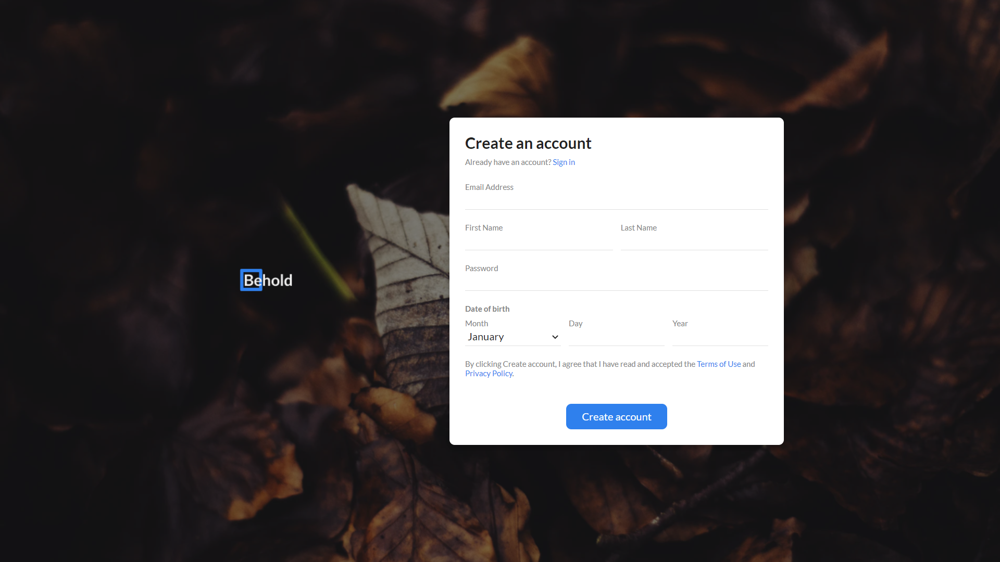
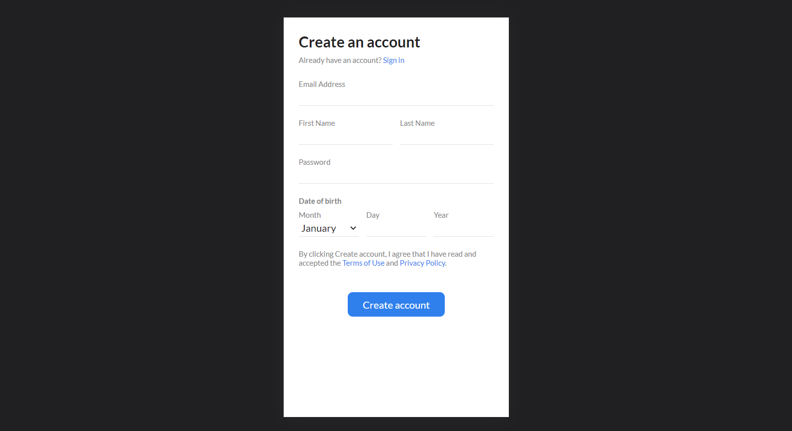

<!-- Please update value in the {}  -->

<h1 align="center">Registration Form</h1>

   Solution for a challenge from  <a href="http://devchallenges.io" target="_blank">Devchallenges.io</a>.

  <h3>
    <a href="https://behold-registration-form.netlify.app/">
      Demo
    </a>
     | 
    <a href="https://devchallenges.io/solutions/">
      Solution
    </a>
     | 
    <a href="https://devchallenges.io/challenges/">
      Challenge
    </a>
  </h3>

<!-- TABLE OF CONTENTS -->

## Table of Contents

- [Overview](#overview)
  - [Built With](#built-with)
- [Features](#features)
- [Contact](#contact)
- [Acknowledgements](#acknowledgements)

<!-- OVERVIEW -->

## Overview

 

### Built With

<!-- This section should list any major frameworks that you built your project using. Here are a few examples.-->

- [HTML](https://www.w3schools.com/html/)
- [CSS](https://www.w3schools.com/css/)
- [JavaScript](https://www.w3schools.com/js/default.asp)

## Acknowledgements

This application/site was created as a submission to a [DevChallenges](https://devchallenges.io/challenges) challenge. The [challenge](https://devchallenges.io/challenges/) was to build an application to complete the given user stories.

## Contact

- GitHub [@ajaybor0](https://github.com/ajaybor0)
- Twitter [@ajaybor0](https://twitter.com/ajaybor0)
- LinkedIn [@ajaybor0](https://www.linkedin.com/in/ajaybor0/)
